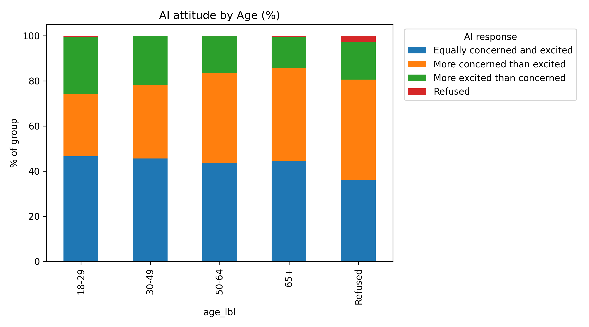
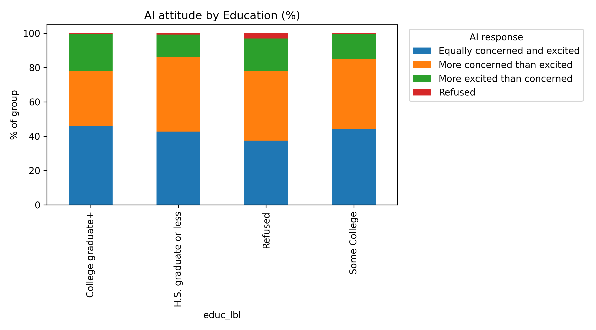

# 📊 Public Attitudes Toward AI (Pew Research, Wave 99)

This project explores **how Americans feel about the increased use of artificial intelligence (AI) in daily life**, based on Pew Research Center’s **American Trends Panel Wave 99 (2021)**.  

Using Python, Pandas, and Jupyter, I analyzed responses to the question:  
> *“Does the increased use of AI in daily life make you feel more excited or more concerned?”*  

I compared results across **age** and **education groups**.  

---

## 🔹 Key Findings  

### By Age  
- Younger adults (18–29) are the most **excited**: 25% feel more excited than concerned.  
- Concern grows with age: only 14% of adults 65+ feel more excited, while 41% feel more concerned.  
- Still, the majority of every age group falls into **“equally excited and concerned.”**  

  

---

### By Education  
- Those with higher education lean slightly more **excited** about AI, while those with lower education lean more **concerned.**  
- Yet across all education groups, the dominant response remains **ambivalence** — equally excited and concerned.  

  

---

## 🔹 Storytelling Insights  

- **Alex, 25 (college student):** Curious and open to AI’s potential, sees it as an adventure.  
- **Linda, 67 (retired):** Concerned about fairness and accountability, wary of rapid adoption.  
- **Jordan, 22 (college senior):** Feels hopeful, sees AI as a tool for innovation.  
- **Maria, 52 (high school graduate):** Feels AI threatens job security and fairness more than it promises opportunity.  

---

## 🔹 Methods  

- **Dataset:** Pew Research Center, *American Trends Panel Wave 99* (Nov 2021).  
- **Tools:** Python, Pandas, Pyreadstat, Matplotlib, Seaborn.  
- **Process:**  
  1. Loaded SPSS `.sav` dataset using `pyreadstat`.  
  2. Re-coded demographic variables (age, education).  
  3. Created crosstabs of AI attitudes by group.  
  4. Visualized results with stacked bar charts.  
  5. Applied Generative AI to produce summaries, headlines, and persona narratives.  

---

## 🔹 Why This Matters  

This project shows how **data analysis + storytelling** can work together:  
- **Analysis** provides clarity on group differences.  
- **AI-assisted narrative** makes insights accessible and human.  

It demonstrates not just technical skill, but also the ability to **communicate data in ways that resonate with people**.  

---

👉 Next steps could include analyzing **income, gender, or political affiliation**, and exploring **open-ended text responses** with natural language processing.